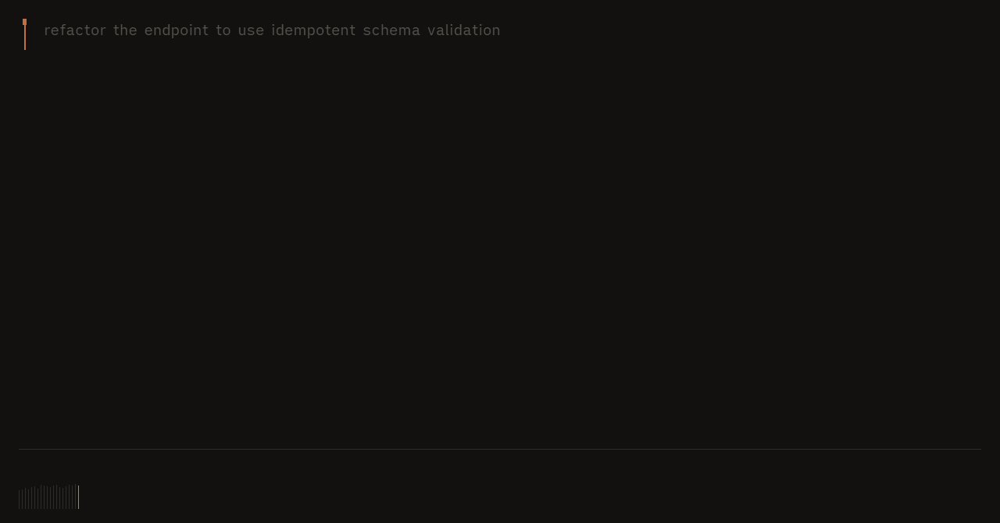
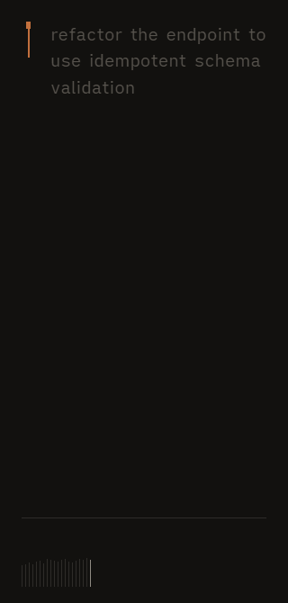
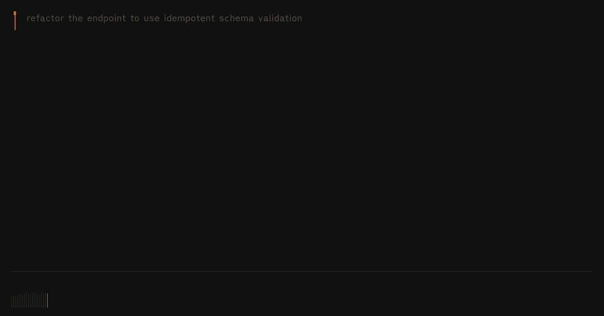
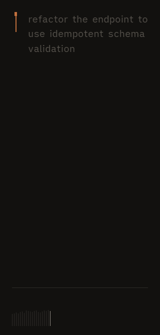
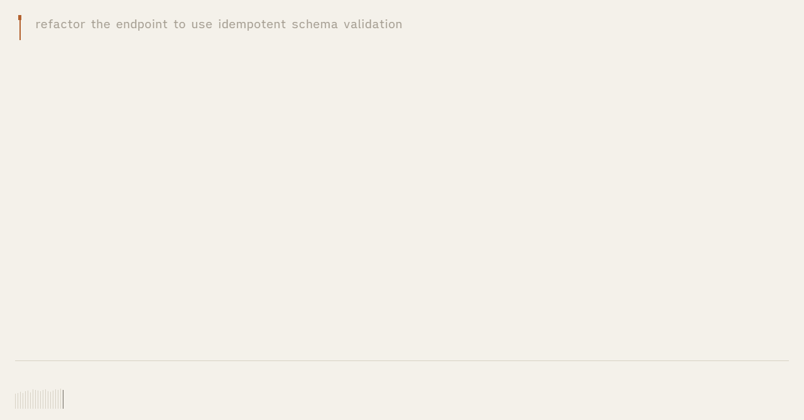
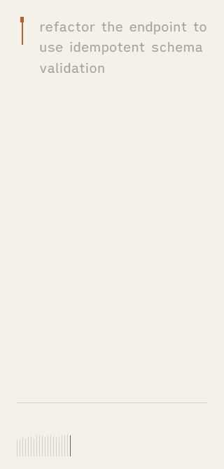
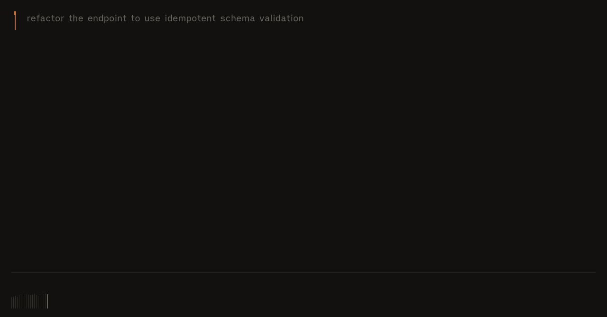
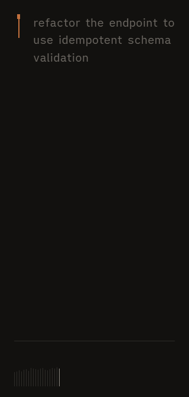

# Dwell

[](https://github.com/janmejai2002/dwell/actions/workflows/ci.yml)
[](https://opensource.org/licenses/MIT)
[](https://code.visualstudio.com/)
[](#performance-contract)
[](#performance-contract)

**Dwell** is a minimalist VS Code extension that teaches prompt writing as a typing skill.

When your coding agent starts working, Dwell waits 25 seconds. If the agent finishes quickly, Dwell does nothing. If the agent is mid-task, Dwell offers a quiet typing drill. One keystroke opens it, the same keystroke closes it.

The drill corpus is plain words, `Enter`, `---` and `>` — never code, never brackets, never symbols. One VSIX installs into **VS Code**, **Cursor**, **Windsurf**, and **Google Antigravity**. A companion Claude Code hook produces the same trigger from a terminal session.

---

## The Loop

```
Agent task detected  ──(wait 25s)──>  Wick appears silently in status bar
                                               │
                                 Press Ctrl+Alt+Space (Cmd+Alt+Space)
                                               │
                                               ▼
                                 Drill panel opens, focused
                                 Type drill at target speed
                                               │
                                 Press Ctrl+Alt+Space to close
                                               │
                                               ▼
                                 Agent has finished; review work
```

1. **25-Second Silent Arming**: Most agent tasks complete inside 25 seconds. Interrupting short tasks is annoying. Dwell stays invisible during fast turns.
2. **The Wick Indicator**: At 25 seconds, a small, lit wick indicator appears in the status bar. If ignored for 6 seconds, it retracts silently.
3. **Instant Reveal**: Press `Ctrl+Alt+Space` (`Cmd+Alt+Space` on macOS) to open the auxiliary panel. The drill is loaded and the caret placed with zero layout jitter.
4. **Typographic Drill**: Characters illuminate as you strike them correctly. Mistakes remain dim with an underline. No jarring red/green flashing.
5. **Fluid Dismissal**: Pressing the same chord immediately hides the panel and resumes your editor focus.

---

## Visual Gallery

Screenshots captured from the running browser harness ([apps/harness](apps/harness)):

| Theme | Full Width (500px) | Narrow Width (320px) |
| :--- | :--- | :--- |
| **Dark (Default)** |  |  |
| **Mid-Drill State** |  |  |
| **Light Theme** |  |  |
| **High Contrast** |  |  |

---

## The Curriculum

Prompt writing is a distinct muscle from writing code. Prompt sentences demand continuous typing cadence, clean syntax blocks, and sharp constraint framing without stopping to hunt for braces or semicolons.

| Tier | Name | Target uWPM | Max Uncorrected Errors | Description |
| :---: | :--- | :---: | :---: | :--- |
| **1** | **Plain** | 55 | 2% | Single-line prompt sentences from real prompt vocabulary (refactor, idempotent, race, schema). |
| **2** | **Break** | 55 | 2% | Multi-line prompts where `Enter` carries meaning. One instruction per line. |
| **3** | **Rule** | 50 | 2% | Alternating instruction blocks and quoted context blocks (`> `) separated by `---`. |
| **4** | **Frame** | 48 | 2% | Complete structured prompts in fixed shape: `Goal` / `Context` / `Constraints` / `Done`. |
| **5** | **Recall** | N/A | 0% | Prompt is visible for 4 seconds, then disappears. Typed from memory and scored on key terms. |
| **6** | **Cold** | N/A | 0% | One-sentence task description with no target text. You write the prompt under time. |

*Progression: Three consecutive passes at or above target unlock the next tier. Tiers never re-lock.*

---

## Interruption Governance

Every interruption rule is implemented as pure functions in `packages/core/src/offer-governor.ts`:

- **Hard Caps**:
  - Minimum 25 seconds of task time before any offer is made.
  - Maximum 1 offer per 20 minutes of wall-clock time.
  - Maximum 4 offers per calendar day.
  - Zero offers within 90 seconds after window focus.
- **Suppression Conditions**:
  - User keystroke in active editor within the last 4 seconds.
  - Quick-pick dropdown, input box, or modal dialog open.
  - Debugger paused at breakpoint.
  - Zen mode active or window unfocused.
  - Do Not Disturb enabled.
  - Drill completed within the last 10 minutes.
- **Earned Appearances**:
  - Three consecutive ignored offers suppress automatic offers for the rest of the session. Dwell remains purely hotkey-driven until self-invoked.

---

## Performance Contract

Dwell's typing hot path is engineered to hold 60 FPS while background builds or language servers saturate the CPU:

- **2 DOM mutations per keystroke maximum**: one class swap on the target glyph, one `translate3d` transform on the caret.
- **0 layout reads during typing**: all glyph positions are measured once at drill load into a `Float32Array`.
- **Single `requestAnimationFrame` loop**: keystrokes are enqueued and drained per frame.
- **Preloaded OFL Typography**: Bundled `iA Writer Quattro S` and `IBM Plex Mono` with `font-display: block` to prevent font-swap layout reflows.

### Benchmark Results (`tests/perf/typing.spec.ts`)

| Metric | Target / Budget | Measured Result | Status |
| :--- | :--- | :--- | :---: |
| **Webview Bundle (Gzipped)** | `< 40 KB` | **4.02 KB** (2.69 KB JS + 1.33 KB CSS) | PASS |
| **p95 Frame Time (4× CPU Throttle, 140 WPM)** | `< 16.7 ms` (60 FPS) | **10.10 ms** | PASS |
| **Frames > 33.3 ms** | `0` | **0** | PASS |
| **Forced Reflows** | `0` | **0** | PASS |
| **Reveal-to-First-Keystroke Latency (p95)** | `< 100 ms` | **8.70 ms** | PASS |
| **Complete VSIX Package Size** | `< 2,048 KB` (2 MB) | **103.88 KB** | PASS |

---

## Architecture

Dwell is organized as a pnpm workspace with strict dependency isolation:

```
dwell/
├── packages/
│   ├── core/         # Pure TypeScript: state machine, scoring, tiers, governor, corpus (0 runtime deps, no DOM, no vscode)
│   ├── webview/      # Vanilla TS + CSS rendering surface, WebAudio keystroke synth (0 UI frameworks)
│   ├── extension/    # VS Code host extension, 7 detection signals, atomic persistence, hook installer
│   └── hook/         # Standalone zero-dependency CJS hook script for Claude Code
├── apps/
│   └── harness/      # Vite dev harness mounting webview outside VS Code for instantaneous development
└── tests/            # Playwright performance contract and visual verification suites
```

### Detection Signals

1. **`claudeHook.ts`** (Priority 100): IPC server receiving events from `hook.cjs`. Exact start/stop.
2. **`hostProbe.ts`** (Priority 95): Probes host-specific agent APIs (e.g., Antigravity agent state API).
3. **`claudeTranscript.ts`** (Priority 80): Watches `~/.claude/projects/` JSONL logs for append activity.
4. **`terminalShell.ts`** (Priority 60): Uses `onDidStartTerminalShellExecution` filtered for long-running commands.
5. **`taskApi.ts`** (Priority 50): Tracks build and test tasks via VS Code Task API.
6. **`docBurst.ts`** (Priority 30): Cross-host heuristic detecting multi-line edits across background files.
7. **`fsWatch.ts`** (Priority 20): Fallback filesystem watcher.

---

## The Anti-AI Aesthetic

Dwell deliberately avoids typical AI product tropes:

- **No gradients** (specifically no violet, purple, indigo, or rainbow meshes).
- **No glassmorphism**, `backdrop-filter`, blur, or translucent cards.
- **No glowing borders** or `box-shadow` used as a glow.
- **No floating orbs**, confetti, particles, or sparkles.
- **No chat bubbles**, avatars, or typing dots.
- **No Inter or Geist** — strictly editorial `iA Writer Quattro S` and `IBM Plex Mono`.
- **No red/green success/error banners** — correctness is indicated solely by typography illumination.
- **Zero telemetry**, zero network calls, zero LLM calls, zero accounts. Works 100% offline.

---

## Installation

### VS Code, Cursor, Windsurf, Antigravity

Download the latest `.vsix` from [Releases](https://github.com/janmejai2002/dwell/releases) and install via CLI:

```bash
code --install-extension dwell-0.1.0.vsix
```

Or in the editor: `Extensions (Ctrl+Shift+X)` → `...` → **Install from VSIX...**

### Claude Code Terminal Hook

On first run, Dwell displays an option to enable the Claude Code hook. You can also install it manually:

The installer safely merges Dwell's hook entries into `~/.claude/settings.json`, preserving existing hooks and generating a timestamped backup before writing:

```json
{
  "hooks": {
    "UserPromptSubmit": [
      {
        "hooks": [
          { "type": "command", "command": "node \"<path-to-dwell>/hook.cjs\" task-start" }
        ]
      }
    ],
    "Stop": [
      {
        "hooks": [
          { "type": "command", "command": "node \"<path-to-dwell>/hook.cjs\" task-end" }
        ]
      }
    ]
  }
}
```

---

## Development

```bash
# Install dependencies
pnpm install

# Build all packages
pnpm -r build

# Run unit and integration tests (106 tests)
pnpm -r test

# Run browser harness locally
pnpm --filter @dwell/harness dev

# Run Playwright typing performance benchmarks & visual tests
pnpm perf

# Package VSIX
pnpm package
```

---

## License

[MIT](LICENSE)
